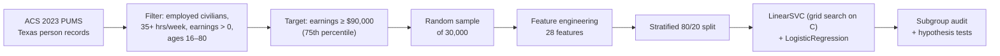

# Disparity and Error Analysis in Linear Income Classification

[](https://github.com/tanjilaafsarirubina/cse437-income-disparity-14/actions/workflows/ci.yml)
[](LICENSE)
[](https://www.python.org/)
[](https://scikit-learn.org/)

We trained linear classifiers to predict whether a full-time worker in Texas earns in the top quartile (at least $90,000 a year), using 2023 U.S. Census microdata. Then we audited where the model goes wrong. The model is about as accurate as you would expect from a linear baseline (F1 = 0.58 on the high-earner class), but it **never predicts a high earner among women without a bachelor's degree**. In the test set, 8.3% of women whose highest education is high school or some college earn at least $90,000, and the model predicts 0%. For men with the same education, it predicts 6.3%.

This was our final project for CSE437 (Data Science), Summer 2026. The full write-up is in [`report/report.pdf`](report/report.pdf), which you can also read on GitHub as [`report/report.md`](report/report.md).


<sub>Light bars show the actual share of high earners in the 6,000-person test set. Dark bars show the share the LinearSVC predicts. The predicted bar for women is missing in the two lowest tiers because the model predicts 0% there.</sub>

## Key findings

We asked three research questions. All numbers are for the held-out test set of 6,000 workers.

1. **Education and gender (RQ1): the model erases lower-credentialed women.**
   - Of 1,267 women whose highest education is high school or some college, 105 (8.29%) are high earners. The model predicts none. For the 1,779 men in the same tier it predicts 112 (6.30%).
   - A one-sample z-test of the predicted rate against the actual rate gives z = −10.70 (exact binomial p = 2.5 × 10⁻⁴⁸). A two-sample test of predicted men vs. predicted women gives z = 9.10 (p ≈ 9 × 10⁻²⁰).
   - Where the model does predict high earners, it widens the gap it sees in the data. Among bachelor's degree holders, the actual gender gap is 25.4 percentage points (52.0% of men vs. 26.5% of women). The predicted gap is 42.1 points (52.2% vs. 10.1%).
   - The logistic regression model also predicts 0% for women in both non-degree tiers. The erasure comes from the linear decision boundary, not from one particular algorithm.

2. **Age (RQ2): the predicted gender gap grows with age.** It is 6.4 points for workers aged 16–29 (9.2% of men vs. 2.8% of women predicted as high earners) and 23.4 points for workers aged 60–80 (35.7% vs. 12.3%).

3. **Employment sector (RQ3): the model misses most high earners in state and local government.** Its false negative rate is 83.3% in state government and 77.8% in local government, compared with 44.8% in the private for-profit sector. Public pay scales cluster just below $90,000: 34% of local and 28% of state government workers in the sample earn $60,000–$89,999, compared with 19% in the private for-profit sector. The model therefore learns large negative weights for these sectors (−0.41 for state and −0.48 for local government, relative to federal). Those weights outweigh a degree or seniority for the public employees who do earn above the threshold.


<sub>The 100% for "Without_Pay" is a single high earner among 9 people and should be ignored.</sub>

## Model performance

Both models were trained on the same 24,000 records and evaluated once on the 6,000-record test set. Precision, recall and F1 are for the high-earner class, which is 26% of the data. A model that always predicts "not a high earner" is 74% accurate but finds no high earners, so we used F1 as the main metric.

| Model | Accuracy | Precision | Recall | F1 |
| --- | ---: | ---: | ---: | ---: |
| Majority-class baseline | 73.65% | 0.00% | 0.00% | 0.00% |
| Logistic regression | 80.47% | 67.14% | 50.66% | 57.75% |
| LinearSVC (C = 10) | 80.57% | 67.66% | 50.28% | 57.69% |

The two model families perform almost identically. The audit uses the LinearSVC predictions.

## Approach



- **Data.** The [American Community Survey 1-year Public Use Microdata Sample](https://www.census.gov/programs-surveys/acs/microdata.html) for Texas, 2023: one row per surveyed person (301,984 people × 287 columns).
- **Cohort and target.** We kept civilians who were employed and at work (`ESR = 1`), worked at least 35 hours a week, had positive earnings, and were aged 16–80. We capped weekly hours at 98. The target `HIGH_EARNER` is 1 when annual earnings (`PERNP`) are at or above the cohort's 75th percentile, which is exactly $90,000.
- **Features.** Age and weekly hours, standardized. Sex, marital status, 8 class-of-worker sectors, 12 occupation groups (collapsed from about 500 Census occupation codes), and 4 education tiers (collapsed from 24 codes), one-hot encoded with the first level dropped. We dropped weeks worked because almost everyone in a full-time cohort works 50–52 weeks. The scaler and encoder are fit on the training split only.
- **Models.** `LinearSVC` (primal solver), tuned with 3-fold cross-validated grid search over C ∈ {0.01, 0.1, 1, 10}, which picks C = 10. `LogisticRegression`, with its default settings, serves as a second linear model family. All random seeds are fixed at 42.
- **Audit.** We compared predicted and actual high-earner rates across education × gender and age × gender. We computed false positive and false negative rates for each sector, and tested the largest disparity with z-tests and an exact binomial test (the exact test matters because the model predicts zero successes).

## Repository structure

```
.
├── notebooks/                  # The analysis, in order (01–05)
│   ├── 01_data_audit_and_eda.ipynb
│   ├── 02_preprocessing.ipynb
│   ├── 03_feature_engineering.ipynb
│   ├── 04_modeling_and_tuning.ipynb
│   └── 05_evaluation_and_error_analysis.ipynb
├── scripts/                    # The same pipeline as plain Python scripts (01–08)
│   └── run_all_check.py        # Runs the scripts in order and checks their outputs
├── src/download_data.py        # Downloads the raw Census file into data/raw/
├── data/
│   ├── raw/                    # psam_p48.csv goes here (212 MB, not committed)
│   ├── processed/              # texas_cleaned_30k.csv, the 30,000-record sample
│   └── README.md               # Data sources and column descriptions
├── models/                     # Trained LinearSVC and LogisticRegression (joblib)
├── figures/                    # The two figures above
├── report/
│   ├── report.pdf              # 10-page project report
│   ├── report.md               # Its source, readable on GitHub
│   └── build_pdf.py            # Rebuilds report.pdf from report.md
└── .github/workflows/ci.yml    # Reruns the full pipeline on every push
```

## Getting started

You need Python 3.12 or later. The pipeline has been tested on 3.12 (in CI) and 3.14.

```bash
git clone https://github.com/tanjilaafsarirubina/cse437-income-disparity-14.git
cd cse437-income-disparity-14
python -m venv .venv
source .venv/bin/activate        # Windows: .venv\Scripts\activate
pip install -r requirements.txt
```

### Reproduce the results from the committed sample

The repository includes the 30,000-record sample, so everything from feature engineering onward runs in about a minute:

```bash
python scripts/run_all_check.py --from-processed
```

This runs scripts 04–08. They split the data, train and tune the models, print the audit tables and hypothesis tests, and redraw the figures. To step through the analysis interactively, run `jupyter lab` and open notebooks 03, 04 and 05 in order.

### Run the full pipeline from the raw Census file

Notebooks 01–02 and scripts 01–03 start from the raw Census file (`psam_p48.csv`, 212 MB). Download it into `data/raw/`, then run everything:

```bash
python src/download_data.py
python scripts/run_all_check.py
```

`download_data.py` gets the file from our Google Drive copy. The same file is in the Census Bureau's [`csv_ptx.zip`](https://www2.census.gov/programs-surveys/acs/data/pums/2023/1-Year/csv_ptx.zip) (53 MB), so you can also unzip `psam_p48.csv` from there into `data/raw/`. The full run takes about a minute, and script 03 regenerates `data/processed/texas_cleaned_30k.csv` byte for byte. See [`data/README.md`](data/README.md) for details.

## Reproducibility notes

- CI downloads the raw file from the Census Bureau, reruns all eight scripts and all five notebooks, and fails unless the regenerated 30,000-record sample matches the committed one exactly.
- Every number in this README and in the report comes from running the committed code on the Census file. `models/` holds exactly the models that notebook 04 and script 05 produce.
- The grid search's top two settings are nearly tied: C = 10 beats C = 1 by 0.001 in cross-validated F1 (0.5864 vs. 0.5852, with a standard deviation of about 0.006 across folds). The two models disagree on 1 of the 6,000 test predictions, so the findings do not depend on the choice.
- The report was revised after grading to fix numbers that did not match the code. The graded version is still in the git history: `git show 32b1670:report/report.pdf > report_graded.pdf`.

## Limitations

- **No survey weights.** We did not use the Census person weights (`PWGTP`), so the results describe the survey sample, not the Texas workforce as a whole.
- **One state, one year.** Pay structures, especially in the public sector, differ across states.
- **Linear models only.** The models cannot represent interactions such as education × gender. That limitation is also what the audit exposes. Natural next steps are tree-based models, reweighting with `PWGTP`, and group-specific decision thresholds to see how much of the erasure they remove.

## Authors

| | Contributions |
| --- | --- |
| **Tanjila Afsari Rubina** ([@tanjilaafsarirubina](https://github.com/tanjilaafsarirubina)) | Pipeline architecture, data ingestion and filtering, hypothesis-testing scripts (01–07), grid search tuning |
| **Sandip Kumar Paul** ([@sandipkumarpaul](https://github.com/sandipkumarpaul)) | Model validation, logistic regression benchmark and cross-validation, visualizations (script 08), error-case analysis, public-sector salary audit, report |

## Data and license

The ACS PUMS data is published by the U.S. Census Bureau and is in the public domain. The code in this repository is released under the [MIT License](LICENSE).
