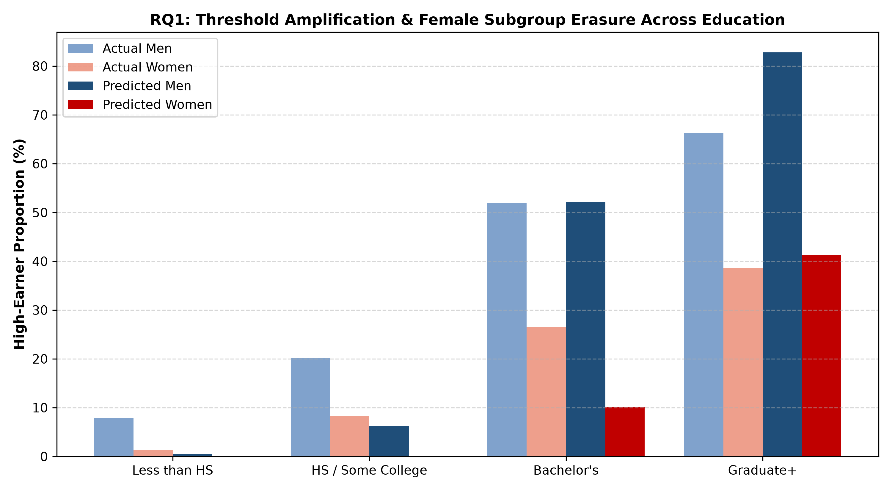
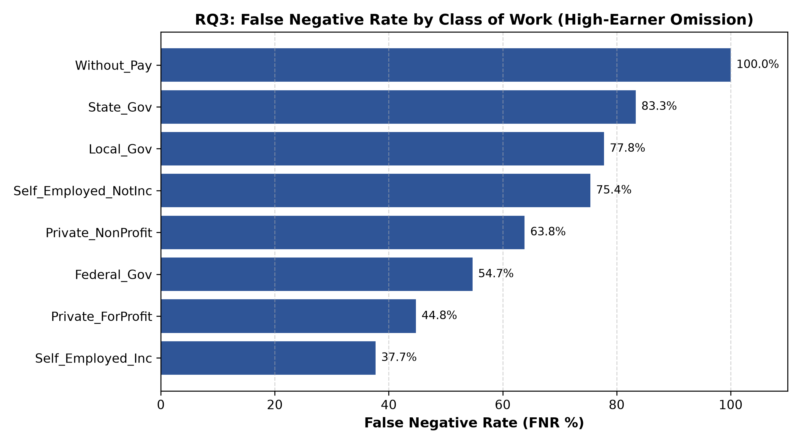

# CSE437 Final Project Report

## Disparity and Error Analysis in Linear Income Classification

*An Audit of 2023 Texas ACS PUMS Microdata*

**Course & Semester:** CSE437 Data Science, Summer 2026

**Group Members** 
Tanjila Afsari Rubina (Student ID: 24241310) 
Sandip Kumar Paul (Student ID: 24241311)

**GitHub Repository:** <https://github.com/tanjilaafsarirubina/cse437-income-disparity-14>

**Dataset:** U.S. Census Bureau, [ACS 2023 1-Year PUMS, Texas](https://www2.census.gov/programs-surveys/acs/data/pums/2023/1-Year/csv_ptx.zip) · [Google Drive copy](https://drive.google.com/drive/folders/1E6GYPV0siUHCq2ohG6EdfZky0AJJOXd3?usp=sharing)

**Submitted:** September 3, 2026 · **Revised:** September 23, 2026

> **About this revision.** After grading, we re-ran the full pipeline on the Census file and found that several numbers in the submitted report did not match what our code produces. This version corrects them: the dataset dimensions and pipeline row counts (Sections 1.2, 1.3 and 2.5), the descriptive statistics (Section 3), the cross-validation results, which select C = 10 rather than C = 1.0 (Section 6), the baseline and logistic regression test metrics (Section 7.1), and the two failure cases, which now describe real test records (Section 7.3). The research findings and hypothesis tests are unchanged. The graded version remains in the repository history.

## Summary

This study evaluates demographic and employment-related predictive disparities in linear income classification using the 2023 U.S. Census Bureau American Community Survey (ACS) 1-Year Public Use Microdata Sample (PUMS) for Texas. The objective is to classify whether a full-time employed civilian worker belongs to the top earnings quartile ($90,000 threshold), creating the binary target variable `HIGH_EARNER`. We benchmark two linear classification model families, a Support Vector Classifier (`LinearSVC` with L2 regularization) and `LogisticRegression`, across 28 engineered demographic, educational, and occupational features. On the held-out test partition of 6,000 records, the tuned LinearSVC achieved an F1-score of 57.69% (80.57% accuracy, 67.66% precision, 50.28% recall), far above the majority-class baseline (0.00% F1). Logistic regression performed almost identically (57.75% F1). Our primary finding is systematic subgroup erasure: the linear decision boundary predicts a 0.00% high-earner rate for women without a bachelor's degree, even though 8.29% of test-set women whose highest credential is a high school diploma, some college, or an associate's degree are high earners (z = −10.70, p < 0.001; exact binomial p = 2.50 × 10−48). Standard linear decision boundaries can therefore sharply amplify empirical wage disparities for lower-credentialed demographic subsets.

## 1. Problem and Dataset

### 1.1 Problem Statement

Algorithmic classification models deployed in labor analytics, credit scoring, and public resource allocation frequently use linear decision boundaries under the assumption of mathematical fairness and interpretability. However, when linear hyperplanes partition complex socioeconomic microdata, additive feature weights can interact with historical wage distributions to create severe localized disparities. This study models top-quartile income classification to investigate where and why linear models fail across demographic intersections (gender, educational attainment, and age) and institutional employment sectors. Auditing these failure modes is critical to ensuring that automated decision systems do not systematically erase or misclassify economically vulnerable cohorts.

### 1.2 Dataset

- **Source:** U.S. Census Bureau, 2023 American Community Survey (ACS) 1-Year Public Use Microdata Sample (PUMS) for Texas (`psam_p48.csv`).
- **Working Link:** [census.gov/programs-surveys/acs/microdata.html](https://www.census.gov/programs-surveys/acs/microdata.html); direct download: [`csv_ptx.zip`](https://www2.census.gov/programs-surveys/acs/data/pums/2023/1-Year/csv_ptx.zip).
- **Collection Method:** Continuous probability-based sample survey measuring demographic, housing, and economic characteristics across U.S. households.
- **Dimensions:** 301,984 person records across 287 survey variables (212 MB as CSV; 53 MB zipped).
- **Time Period:** Survey year 2023 (1-year PUMS, released 2024).
- **Licence / Terms:** Public domain U.S. Government data; free for academic and commercial use under 13 U.S.C. § 9.

### 1.3 Target Variable

The target variable is `HIGH_EARNER`, a binary classification indicator derived from a person's annual earnings (`PERNP`). Within the filtered civilian full-time workforce (N = 112,117), the 75th percentile of annual earnings is exactly $90,000.

- **Class 0 (Standard Earner, < $90,000):** 73.79% of the filtered population.
- **Class 1 (Top-Quartile Earner, ≥ $90,000):** 26.21% of the filtered population.

### 1.4 Three Questions

From our approved project proposal, this audit answers:

1. **RQ1 (Educational Attainment & Gender Disparity):** How do model-predicted high-earner rates diverge between men and women across educational attainment tiers, and does the linear classifier produce subgroup erasure for lower-credentialed women?
2. **RQ2 (Age Cohort Trajectories):** How does the predicted high-earner gender gap evolve across career stages from early-career (ages 16–29) to late-career (ages 60–80)?
3. **RQ3 (Institutional Sector Error Profiles):** How do classification errors (False Negative Rate and False Positive Rate) distribute across Class of Work (COW) sectors, and what data artifacts drive high-error sectors?

## 2. Data Handling and Preprocessing

### 2.1 Data Quality Audit

An audit of the raw microdata (`psam_p48.csv`) revealed missing values, structural blanks, and outlier tails:

- **Missing Values:** Respondents outside the labor force leave earnings and hours blank: `PERNP` is missing for 55,043 records (18.2%) and `WKHP` for 146,742 (48.6%).
- **Zero / Negative Values:** 91,917 records report zero or negative earnings, down to −$7,900 for business losses.
- **Extreme Tails:** Weekly hours worked (`WKHP`) reach 99, and age (`AGEP`) spans 0 to 92 years.

### 2.2 Missing Values Strategy

- **Mechanism Assumed:** Missing Completely at Random (MCAR) for non-response within the target labor universe; Missing by Design for structural non-workers (children, retirees).
- **Action:** Coerced all non-numeric sentinels to NaN and dropped records with a missing value in any of the 10 core fields (`dropna`). Dropping non-workers is methodologically justified because income classification is defined strictly over the active labor force.

### 2.3 Outliers

- **Age Outliers:** Filtered to ages 16–80 to eliminate variance from the sparse, heterogeneous tail of extreme senior labor (>80 years). This removed 202 workers.
- **Work Hours Clipping:** Capped `WKHP` at 98 hours (`WKHP.clip(upper=98)`), affecting 282 records, to limit leverage from extreme reporting artifacts without dropping valid full-time records.

### 2.4 Transformation and Scaling

- **Categorical Encoding:** One-hot encoded using `OneHotEncoder(drop='first', sparse_output=False)` to prevent multicollinearity in linear models.
- **Numeric Scaling:** Applied `StandardScaler` to continuous predictors (`AGEP`, `WKHP`). Standardization was chosen because distance- and margin-based linear classifiers are sensitive to feature scales; without zero-mean, unit-variance scaling, higher-magnitude continuous variables like age (16–80) would artificially dominate the objective function over one-hot binary indicators.
- **Data Leakage Prevention:** The transformer was fit exclusively on the training partition (`X_train`) and used to transform `X_test`.

### 2.5 Before and After Comparison Table

| Pipeline Stage | Row Count | Column Count | Key Changes & Filtering Applied |
| --- | ---: | ---: | --- |
| Raw Microdata | 301,984 | 287 | Unfiltered Texas PUMS person records. |
| Variable Selection | 301,984 | 10 | Retained 10 core fields (`PERNP`, `WKHP`, `ESR`, `AGEP`, `SEX`, `SCHL`, `MAR`, `COW`, `OCCP`, `WKWN`). |
| Missing Values Dropped | 155,242 | 10 | Removed records with a blank core field, mostly people outside the labor force. |
| Active Labor Filter | 112,319 | 10 | Kept civilians employed and at work (`ESR = 1`), full-time (`WKHP ≥ 35`), with `PERNP > 0`. |
| Outlier Handling | 112,117 | 10 | Kept ages 16–80; capped `WKHP` at 98 hours. |
| Domain Engineering | 112,117 | 13 | Mapped `OCCP` codes to 12 SOC domains, labeled `COW` sectors, derived `HIGH_EARNER`. |
| Subsample | 30,000 | 13 | Simple random sample (`random_state = 42`) for stable LinearSVC convergence. |
| Encoded Matrices | 24,000 / 6,000 | 28 | Stratified train/test split; 2 scaled and 26 dummy features. |

## 3. Statistical Analysis

All statistics in this section describe the filtered full-time workforce (N = 112,117).

### 3.1 Descriptive Statistics

- **Annual Earnings (`PERNP`):** Median = $55,000; Mean = $77,899; Standard Deviation = $86,256; 75th Percentile = $90,000. Strong positive skewness (4.06), characteristic of income distributions.
- **Weekly Hours (`WKHP`):** Median = 40; Mean = 44.2 hours; Standard Deviation = 8.7 hours. 60.7% of respondents report exactly 40 hours/week.
- **Age (`AGEP`):** Median = 43; Mean = 43.8 years; Interquartile Range (IQR) = 33–54 years.
- **Categorical Frequencies:** Private for-profit employers account for 67.6% of workers; state and local government for 13.7% (local 9.3%, state 4.4%); management, business, finance and STEM occupations for 30.4%.

### 3.2 Relationships to Target

- **Education vs. High-Earner Rate:** Less than HS: 6.6%; HS/Some College: 14.7%; Bachelor's: 38.5%; Graduate+: 53.6%.
- **Gender Disparity:** Men account for 69.1% of the top-quartile earnings bracket; 32.3% of men and 18.4% of women are high earners.
- **Sector Differences:** 28.2% of private for-profit employees are high earners, compared with 34.5% in the federal government, 21.4% in state government, and 11.0% in local government.

### 3.3 What the Data Says So Far

- **Observation 1:** Education shows the steepest gradient: the high-earner rate rises eightfold from workers without a high school diploma (6.6%) to those with a graduate degree (53.6%).
- **Observation 2:** A substantial unadjusted gender gap exists within every educational attainment band, for example 49.9% of men versus 26.1% of women among bachelor's degree holders.
- **Observation 3:** Public-sector compensation is compressed just below the threshold: 32.7% of local and 27.3% of state government workers earn $60,000–$89,999, compared with 19.4% in private for-profit firms.

## 4. Feature Engineering

### 4.1 Derived Features

- **Educational Attainment Tiers (`SCHL_TIER`):** Collapsed 24 Census attainment codes into 4 ordinal tiers (`Less_than_HS`, `HS_or_Some_College`, `Bachelors`, `Graduate_Plus`). The `HS_or_Some_College` tier covers high school diplomas, GEDs, some college, and associate's degrees.
- **Occupational Domains (`OCCP_GROUP`):** Mapped granular 4-digit Census occupation codes into 12 broad functional domains (e.g., `STEM_Science_Architecture`, `Management_Business_Finance`).

### 4.2 Dimensionality Reduction

The 524 distinct occupation codes in the filtered workforce would have induced extreme sparsity and overfitting under one-hot encoding. By consolidating them into 12 SOC domains based on federal labor definitions, we reduced categorical dimensionality by 97.7% while preserving occupational labor patterns.

### 4.3 Feature Selection

- **Omitted Feature:** Weeks worked in the past 12 months (`WKWN`).
- **Justification:** Inspected during feature exploration and dropped for parsimony. Because the cohort was already filtered to full-time workers actively at work (`WKHP ≥ 35`, `ESR = 1`), `WKWN` exhibited near-zero variance (91.7% worked 50–52 weeks) and added unnecessary complexity.

### 4.4 Final Feature Set

The final feature matrix contains 28 features (2 scaled continuous: `AGEP`, `WKHP`; 26 dummy-encoded categorical indicators across `SEX_LABEL`, `SCHL_TIER`, `OCCP_GROUP`, `COW_GROUP`, and `MAR`). This set provides a balanced representation of human capital, labor supply, and institutional sector controls.

## 5. Modeling and Validation

### 5.1 Validation Strategy

- **Split Scheme:** 80% Train (N = 24,000) / 20% Test (N = 6,000).
- **Stratification:** Stratified on `HIGH_EARNER` to maintain an identical 74/26 class distribution across splits.
- **Random Seed:** Set to 42 across all sampling, partitioning, and estimators for strict reproducibility.

### 5.2 Baseline

- **Trivial Predictor:** Zero-R / Majority-Class Classifier (predicts standard earner, Class 0, for all instances).
- **Baseline Score:** Accuracy = 73.65%, Precision = 0.00%, Recall = 0.00%, F1-Score = 0.00%.

### 5.3 Model Families

1. **Support Vector Classifier (`LinearSVC`):** Maximizes the margin of the hyperplane separating the classes, with L2 regularization (C penalty). Selected for strict linearity to test threshold margin mechanics without non-linear artifacts. Solved via primal optimization (`dual=False`), which is preferred and computationally faster when the training instance count (N = 24,000) significantly exceeds the feature dimensionality (D = 28).
2. **Logistic Regression (`LogisticRegression`):** Models the posterior class probability via log-odds linearity, with scikit-learn's default L2 regularization (C = 1.0). Serves as a probabilistic counterpart to verify whether margin geometry diverges from maximum likelihood estimation.

### 5.4 Metrics

- **Primary Metric:** Minority-Class F1-Score (High-Earner).
- **Rationale:** Accuracy is misleading under class imbalance (74/26). A trivial model achieves ~74% accuracy while identifying zero high earners. F1 balances Precision and Recall on the critical top-quartile class.

## 6. Hyperparameter Tuning

### 6.1 Search Space

| Model | Hyperparameter | Search Space | Objective |
| --- | --- | --- | --- |
| LinearSVC | Regularization Parameter (C) | {0.01, 0.1, 1.0, 10.0} | Margin violation penalty vs. weight shrinkage. |
| LogisticRegression | Inverse Regularization (C) | Fixed at 1.0 (default) | Untuned benchmark from a second model family. |

The search space spans four logarithmic orders of magnitude ({0.01, 0.1, 1.0, 10.0}), from severe margin shrinkage (heavy underfitting) to minimal margin tolerance, to capture the regularization saturation point without unnecessary compute overhead.

### 6.2 Method

- **Algorithm:** 3-Fold Stratified `GridSearchCV` on the training partition (N = 24,000).
- **Scoring Function:** Minority-Class F1 (`scoring='f1'`).
- **Total Candidates:** 4 parameter settings × 3 folds = 12 fits.

### 6.3 Results

| Candidate Value (C) | Mean Validation F1 | Std. Dev. Across Folds | Mean Training F1 |
| --- | ---: | ---: | ---: |
| C = 0.01 | 0.5781 | 0.0049 | 0.5778 |
| C = 0.10 | 0.5843 | 0.0054 | 0.5852 |
| C = 1.00 | 0.5852 | 0.0056 | 0.5863 |
| **C = 10.00 (selected)** | **0.5864** | 0.0057 | 0.5867 |

**Trend:** Validation F1 rises from C = 0.01 to C = 0.1 and is nearly flat beyond it. C = 10 scores highest, but its lead over C = 1.0 (0.0012) is much smaller than the fold-to-fold standard deviation (about 0.006), and the two models disagree on only 1 of the 6,000 test predictions. Training and validation F1 are nearly equal at every setting, so the model is limited by its linear form rather than overfitting. We use the grid search's choice, C = 10, throughout.

## 7. Results, Visualization and Error Analysis

### 7.1 Test Set Performance Comparison Table

Evaluated once on the held-out test partition (N = 6,000):

| Model / Baseline | Accuracy | Precision (Class 1) | Recall (Class 1) | F1-Score (Class 1) | Macro F1 |
| --- | ---: | ---: | ---: | ---: | ---: |
| Majority-Class Baseline | 73.65% | 0.00% | 0.00% | 0.00% | 42.41% |
| LogisticRegression (C = 1.0) | 80.47% | 67.14% | 50.66% | 57.75% | 72.52% |
| **LinearSVC (Tuned, C = 10)** | **80.57%** | **67.66%** | **50.28%** | **57.69%** | **72.54%** |

The two linear model families are within 0.6 percentage points of each other on every metric. The audit below uses the LinearSVC predictions.

### 7.2 Visualizations

*Figure 1: Empirical ground truth vs. LinearSVC-predicted high-earner rates across educational attainment by gender (test set). The model predicts 0.00% for women in the Less than HS and HS/Some College tiers, and at the Bachelor's tier it widens an empirical gap of 25.42 percentage points into a predicted gap of 42.07 percentage points.*

*Figure 2: False Negative Rate (FNR %) across Class of Work (employment sectors). High-earner omission is most severe in State Government (83.33%) and Local Government (77.78%), driven by salary clustering just below the $90,000 boundary and negative sectoral weights. The 100.00% rate for Without Pay reflects extreme sample sparsity (one high earner among N = 9).*

### 7.3 Error Analysis

**Failure subgroups.** False negatives concentrate among workers without a bachelor's degree, and above all among women without one: the model misses all 107 of them.

| Actual High Earners in the Test Set | N | False Negative Rate |
| --- | ---: | ---: |
| Women without a bachelor's degree | 107 | 100.0% |
| Men without a bachelor's degree | 388 | 82.2% |
| Women with a bachelor's degree or higher | 370 | 58.4% |
| Men with a bachelor's degree or higher | 716 | 20.1% |

**Why erasure happens.** The decision score is a sum of fixed weights. Relative to a bachelor's degree, the HS/Some College tier subtracts 0.415 and Less than HS subtracts 0.625. Being male adds 0.291, and the intercept is −0.271. In practice, no woman in the HS/Some College tier reaches the threshold: the highest score among the 1,267 test-set women in this tier is −0.10. In the same tier, men score as high as +0.57, and 112 of them are predicted to be high earners.

- **Concrete Failure Case 1 (False Negative — Subgroup Erasure):** A 58-year-old married woman with an associate's degree, working 60 hours a week as a procurement clerk for a private nonprofit, with annual earnings of $230,000. Her decision score is −0.74. The intercept (−0.27), her education tier (−0.42), the nonprofit sector (−0.27), and the office occupation group (−0.07) outweigh the credit for her age (+0.11) and long hours (+0.17). Even with the male coefficient added and a bachelor's degree in place of her associate's degree, her score would remain just below zero (−0.035). Nothing in the feature set captures what drives her earnings, so a linear model has no way to identify her.
- **Concrete Failure Case 2 (False Negative — Public Pay-Scale Compression):** A 38-year-old married man with a bachelor's degree, working 50 hours a week as a police officer for a local government, earning $97,000. His decision score is −0.28. The local government coefficient (−0.480, relative to federal employees) outweighs the male coefficient (+0.291) and the protective service occupation (+0.155). The same worker employed by a private for-profit firm would score +0.17 and be classified as a high earner.

### 7.4 Answers to the Three Questions

- **Answer to RQ1:** Predicted high-earner rates diverge sharply by gender across education. The model produces complete subgroup erasure for women in the "Less than HS" (0.00%) and "HS or Some College" (0.00%) tiers. The logistic regression model shows the same 0.00% rates.
    - *Hypothesis Test 1 (Model vs. Empirical Truth for Women):* A 1-sample proportion z-test yields z = −10.70 (p < 0.001; exact binomial p = 2.50 × 10−48), confirming statistically significant underprediction relative to the empirical 8.29% ground truth (105 of 1,267 women).
    - *Hypothesis Test 2 (Predicted Men vs. Women):* A 2-sample proportion z-test yields z = 9.10 (p < 0.001), confirming that, holding high-school attainment fixed, the predicted rate for men (6.30%, 112 of 1,779) significantly exceeds that for women (0.00%). Furthermore, at the Bachelor's level, threshold amplification widens an empirical 25.42 pp gap into a 42.07 pp predicted gap.
- **Answer to RQ2:** Predictive disparity widens monotonically across life cohorts: the gender gap increases from 6.41 percentage points among workers aged 16–29 (9.23% of men vs. 2.82% of women predicted as high earners) to 23.41 percentage points among workers aged 60–80 (35.66% vs. 12.26%), reflecting compounding career tenure weights.
- **Answer to RQ3:** Classification errors diverge across sectors. Federal Government exhibited the highest total error rate (31.79%). False Negative Rates were highest in State Government (83.33%) and Local Government (77.78%), driven by pay-scale clustering just below the $90,000 threshold and negative sectoral coefficients (State_Gov: −0.411, Local_Gov: −0.480).

## 8. Limitations and Next Steps

- **Omission of Survey Weights:** This analysis omitted Census person-level weights (`PWGTP`); findings describe the empirical sample rather than weighted Texas population totals.
- **Geographic Boundary:** Restricting data to Texas in 2023 limits generalizability to states with higher public-sector unionization or different tax structures.
- **Linear Inductive Bias:** A strictly linear classifier cannot model interaction effects (e.g., non-linear career re-entry penalties for women) or localized density shifts around $90,000.
- **Next Steps:** Future iterations should evaluate non-linear tree ensembles (e.g., XGBoost), incorporate Census survey weights (`PWGTP`), and test threshold-adjustment post-processing to remediate subgroup erasure.

## 9. Contributions Table

| Member Name | Student ID | Identifiable Contribution |
| --- | --- | --- |
| Tanjila Afsari Rubina | 24241310 | Pipeline architecture, data ingestion, filtering, and hypothesis testing scripts (01–07); grid search hyperparameter tuning implementation and parameter space evaluation. |
| Sandip Kumar Paul | 24241311 | Model validation, LogisticRegression baseline benchmarking, and cross-validation; data visualization script (08), Matplotlib figure design, and error bar plots; error case analysis, public-sector salary band auditing, and report documentation. |

## References

1. U.S. Census Bureau. (2024). *American Community Survey 2023 1-Year PUMS Microdata (Texas).* U.S. Department of Commerce.
2. Pedregosa, F., et al. (2011). Scikit-learn: Machine Learning in Python. *Journal of Machine Learning Research, 12*, 2825–2830.
3. McKinney, W. (2010). Data Structures for Statistical Computing in Python. *Proceedings of the 9th Python in Science Conference.*
4. Hunter, J. D. (2007). Matplotlib: A 2D Graphics Environment. *Computing in Science & Engineering, 9*(3), 90–95.
5. AI Assistance Declaration: Large language models were used as technical thought partners to assist in structuring code comments, formatting Markdown documentation, and calculating test-statistic companion checks. For the September 2026 revision, an AI coding assistant (Claude, by Anthropic) re-ran the full pipeline on the Census file and replaced numbers in this report that did not match the code's output.
